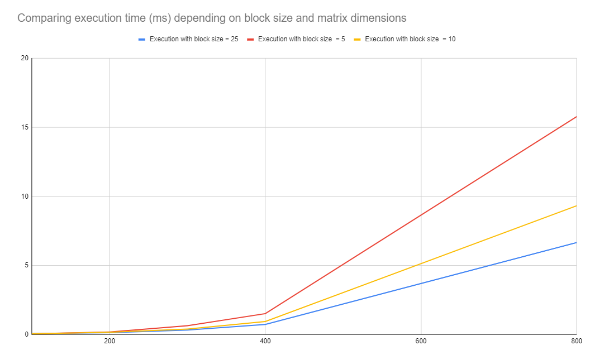

About lab
------------
Info for files:
-  mainGpu.h              - main
-  matMulGPU.cu  -  multiplication

### Time with CUDA (block size = 10)
Matrix's size is: 100
Def meth's time: 0.06 ms
_______________________________
Matrix's size is: 200
Def meth's time: 0.17 ms
_______________________________
Matrix's size is: 300
Def meth's time: 0.40 ms
_______________________________
Matrix's size is: 400
Def meth's time: 0.95 ms
_______________________________
Matrix's size is: 800
Def meth's time: 9.33 ms
_______________________________

#### Size - number of columns (n.columns = n.rows)
#### Comparing number of threads:
|Block size        | Time(size 100) | Time(size 200) | Time(size 300) | Time(size 400) | Time(size 800) |
|------------------:| -----:| -----:| -----:| -----:| -----:|
| 5   |   0.06 ms | 0.19 ms | 0.65 ms | 1.52 ms | 15.79 ms |
| 10   |   0.06 ms | 0.17 ms | 0.40 ms | 0.95 ms |9.33 ms|
| 25   | 0.08 ms | 0.14 ms | 0.33 ms | 0.74 ms | 6.67 ms |

Testing on gtx 1060.

##### Conclusion:
###### Block_size represents number of threads = > we get better performance by increasing the block size 
###### Keep in mind - gtx 1060 has a limit blocks_size (lower than 100)
###### Each block cannot have more than 512/1024 threads in total
###### The maximum dimensions of each block are limited to [512,512,64]/[1024,1024,64]
###### Each block cannot consume more than 8k/16k/32k/64k/32k/64k/32k/64k/32k/64k registers total
###### Each block cannot consume more than 16kb/48kb/96kb of shared memory
