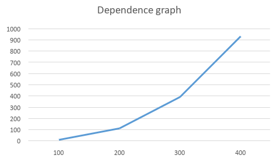

About lab
------------
Info for files:
-  Data.txt              - all values from two matrices
- Matrix.txt           - result matrix
-  Result.txt           - time for different matrices sizes
-  main.cpp             - obviously
-  main.py              - correctness check

##### About main.cpp: I represented matrices as arrays and used a formula to get the elements from the desired rows or columns (see code).
Matrix's size is: 100
Def meth's time: 15.0113
_______________________________
Matrix's size is: 200
Def meth's time: 117.037
_______________________________
Matrix's size is: 300
Def meth's time: 396.682
_______________________________
Matrix's size is: 400
Def meth's time: 936.371
_______________________________ 

###### Lab1: matrix product, and subsequent improvement in the form of parallel streams. Looking at file Result.txt we can say that the time directly depends on the size of the matrices, so for better time we can use parallel programming, which i'll show in the next branches of this rep
