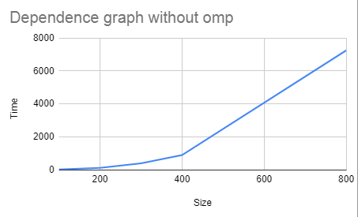

About lab
------------
Info for files:
-  Data.txt              - all values from two matrices
-  Time without.txt           - time for multiply matrices without parallel
-  Time with omp.txt    - time for multiply with parallel
-  main.cpp             - obviously
-  main.py              - correctness check

##### About main.cpp: I represented matrices as arrays and used a formula to get the elements from the desired rows or columns (see code).
### Time without
Matrix's size is: 100
Def meth's time: 14.3727
_______________________________
Matrix's size is: 200
Def meth's time: 113.989
_______________________________
Matrix's size is: 300
Def meth's time: 387.619
_______________________________
Matrix's size is: 400
Def meth's time: 889.16
_______________________________
Matrix's size is: 800
Def meth's time: 7246.96
_______________________________

### Time with omp
Matrix's size is: 100
Def meth's time: 26.6091
_______________________________
Matrix's size is: 200
Def meth's time: 28.5437
_______________________________
Matrix's size is: 300
Def meth's time: 96.3207
_______________________________
Matrix's size is: 400
Def meth's time: 224.973
_______________________________
Matrix's size is: 800
Def meth's time: 1823.44
_______________________________

#### As we can see - the execution time with parallel calculations is much lower than standard execution.
#### Runtime ration:
With omp / Without  
Size = 100 it's 1,85  
Size = 200 it's 0,25   
Size = 300 it's 0,24   
Size = 400 it's 0,25  
Size = 800 it's 0,25  
###### Lab2: Compare parallel execution and standard execution
