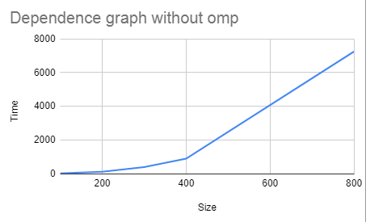
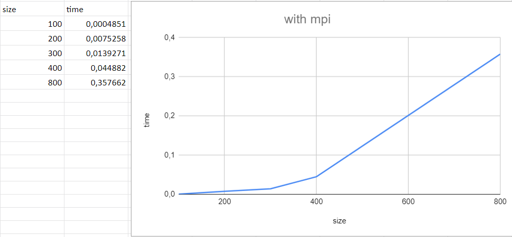

About lab
------------
Info for files:
-  Data.txt              - all values from two matrices
-  main.cpp / result.txt            - obviously
-  main.py              - correctness check

##### About main.cpp: I represented matrices as arrays and used a formula to get the elements from the desired rows or columns (see code).
### Time without
Matrix's size is: 100
Def meth's time: 14.3727
_______________________________
Matrix's size is: 200
Def meth's time: 113.989
_______________________________
Matrix's size is: 300
Def meth's time: 387.619
_______________________________
Matrix's size is: 400
Def meth's time: 889.16
_______________________________
Matrix's size is: 800
Def meth's time: 7246.96
_______________________________

### Time with MPI (number of thr. 4)
Matrix's size is: 100
Def meth's time: 0.0004851
_______________________________
Matrix's size is: 200
Def meth's time: 0.0075258
_______________________________
Matrix's size is: 300
Def meth's time: 0.0139271
_______________________________
Matrix's size is: 400
Def meth's time: 0.044882
_______________________________
Matrix's size is: 800
Def meth's time: 0.357662
_______________________________

#### As we can see - the execution time with parallel calculations is much lower than standard execution.
#### Comparing number of threads:
|Number of threads        | Time(size 100) | Time(size 200) | Time(size 300) | Time(size 400) | Time(size 800) |
|------------------:| -----:| -----:| -----:| -----:| -----:|
| 2   | 0.0009487 | 0.0104299 | 0.0300095 | 0.0607942 | 0.481196 |
| 4   |   0.0006925 | 0.0038242 | 0.0155607 | 0.0338696 | 0.358806 |
|8   |    0.0002288 |  0.0018791 | 0.0076221 | 0.0235641 | 0.379881|

Testing on Intel Core i5-7400.
###### Lab3: Compare parallel execution and standard execution
